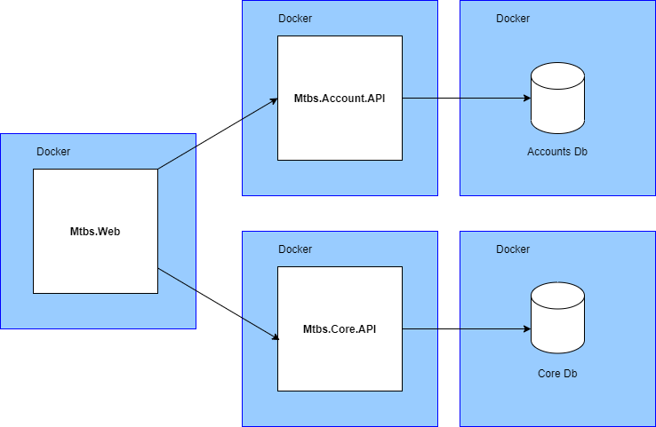

# Movie Ticket Booking System

To run the APIs in the solution run bellow commands from the command line in the root directory of the folder:

```
dotnet restore "MovieTicketBookingSystem"
```

```
docker-compose up -d --build
```

Then the APIs will be available at following url:

https://localhost:51443/api/v1/Account/register
https://localhost:51443/api/v1/Account/register-admin
https://localhost:51443/api/v1/Account/login
https://localhost:51443/api/v1/Cities/{cityName}/Movies
https://localhost:51443/api/v1/Movies/{movieName}/Cinemas/{cinema}/Shows

# Architecure

